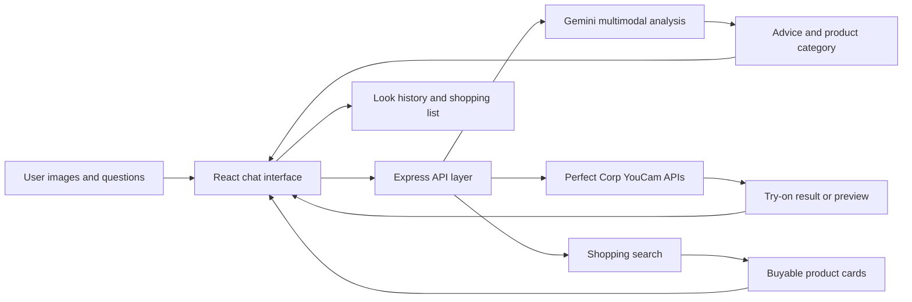

<div align="center">

# Naxora

### An image-first, agentic shopping assistant

Upload your outfit. Ask what is missing. Try real products on. Keep the pieces worth buying.

[](https://github.com/arzumanabbasov/agentic-shopping/actions/workflows/ci.yml)
[](LICENSE)
[](https://nodejs.org/)

</div>

## Why Naxora?

Online shopping is fragmented. Inspiration lives on visual boards, products live across stores, and virtual try-on usually exists as an isolated retailer feature.

Naxora turns those steps into one conversation. It sees the user's current outfit, understands the occasion and goal, recommends a concrete missing piece, finds buyable products, chooses the appropriate Perfect Corp try-on engine, and remembers every item considered along the way.

The result feels like **AI virtual try-on + visual discovery + live shopping**, operated by an agent rather than a dashboard.

## Core experience

1. **Show your current outfit.** Upload a full-body image.
2. **Set the context.** Tell Naxora where you are going and what the look should achieve.
3. **Get visual advice.** Gemini analyzes the actual image and identifies the most useful next piece.
4. **Explore real products.** Search best-match, lower-price, or premium options.
5. **Try an item.** Naxora recognizes the product category and selects the correct VTO workflow.
6. **Keep iterating.** Clothing updates the saved outfit; shoes, hair, and jewelry remain safe previews.
7. **Leave with a list.** Every uploaded, recommended, and tried item stays in a checkable shopping list.

## Highlights

- **Agent-first interaction** — users express intent while Naxora chooses tools and next actions.
- **Multimodal styling** — analysis uses the latest outfit image, not a generated text description.
- **Canonical-look memory** — compatible clothing results build on the latest saved outfit.
- **Non-destructive previews** — generative shoe, hair, and jewelry results cannot silently erase previous progress.
- **Automatic product routing** — recognizes clothing, shoes, hairstyles, earrings, necklaces, watches, bracelets, rings, and unsupported accessories.
- **Personal color profile** — optionally detects skin, hair, eye, and lip colors for future recommendations.
- **Live product discovery** — returns purchasable products with price, image, source, and link.
- **Session shopping list** — tracks considered products, try-on status, links, and completed purchases.
- **Visual undo and redo** — moves backward and forward through outfit states.
- **Accessible language** — the interface says “Try it on me,” not “execute VTO task.”

## API capability map

| User adds | Naxora behavior | Perfect Corp capability |
| --- | --- | --- |
| Shirt, trousers, dress, jacket | Updates the canonical outfit | AI Clothes V3 |
| Shoes | Creates a non-destructive preview | AI Shoes VTO |
| Hairstyle reference | Creates a non-destructive preview | Hair Transfer V2.1 |
| Earrings, necklace, watch, bracelet, ring | Routes to the matching preview engine | 2D Jewelry VTO |
| Clear face photo | Builds a reusable color profile | Skin Tone Analysis |
| Belt, bag, hat, scarf | Rates compatibility and saves the item without offering unsupported VTO | Visual analysis |

## Architecture



The frontend never receives provider credentials. It communicates only with the Naxora server, which validates uploads, routes AI tasks, polls results, and normalizes provider responses.

## Technology

- React 19 and Vite 7
- Express 5 and Node.js 20+
- Gemini multimodal image analysis
- Perfect Corp YouCam AI APIs
- SerpAPI Google Shopping integration with demo-mode fallbacks
- Vercel static hosting and Node.js Functions

## Run locally

### Requirements

- Node.js 20 or newer
- npm
- At least one provider key for live AI behavior

### Installation

```bash
git clone https://github.com/arzumanabbasov/agentic-shopping.git
cd agentic-shopping
cp .env.example .env
npm install
npm start
```

Open [http://127.0.0.1:5173](http://127.0.0.1:5173).

For a production-style local run:

```bash
npm run build
npm run server
```

Then open [http://127.0.0.1:8787](http://127.0.0.1:8787).

<details>
<summary>Windows PowerShell commands</summary>

```powershell
Copy-Item .env.example .env
npm.cmd install
npm.cmd start
```

</details>

## Environment variables

```dotenv
YOUCAM_API_KEY=your_youcam_api_key
GEMINI_API_KEY=your_gemini_api_key
SERPAPI_API_KEY=optional_google_shopping_serpapi_key
PORT=8787
```

| Variable | Required | Purpose |
| --- | --- | --- |
| `YOUCAM_API_KEY` | For live try-on and color analysis | Starts and polls Perfect Corp AI tasks |
| `GEMINI_API_KEY` | For live visual styling | Analyzes outfits and recognizes product categories |
| `SERPAPI_API_KEY` | Optional | Returns live Google Shopping product cards |
| `PORT` | Optional | Local Express port; defaults to `8787` |

Never prefix credentials with `VITE_`, place them in frontend code, or commit `.env`.

### Demo behavior

- Without Gemini, Naxora returns sample styling guidance and uses filename-based product classification.
- Without SerpAPI, product cards link to Google Shopping and retailer searches.
- Without an enabled Perfect Corp key and sufficient units, try-on endpoints return a configuration/provider error.

## Deploy to Vercel

[](https://vercel.com/new/clone?repository-url=https%3A%2F%2Fgithub.com%2Farzumanabbasov%2Fagentic-shopping)

1. Import this repository into Vercel.
2. Keep the build command as `npm run build` and output directory as `dist`.
3. Add server-side environment variables under **Project Settings → Environment Variables**.
4. Deploy.

The committed [`vercel.json`](vercel.json) routes `/api/*` to the Express function and serves the remaining paths from the Vite application.

Vercel Functions limit request and response bodies to 4.5 MB, so Naxora caps uploads at 4 MB. Compress large phone photos before uploading.

## Local API routes

| Method | Route | Purpose |
| --- | --- | --- |
| `POST` | `/api/style/classify-product` | Recognize the uploaded product and select a capability |
| `POST` | `/api/style/analyze-images` | Analyze the latest visual look and item history |
| `GET` | `/api/shop/search?q=...` | Find buyable product matches |
| `POST` | `/api/youcam/upload` | Create and complete a provider upload |
| `POST` | `/api/youcam/vto` | Start a routed virtual try-on task |
| `GET` | `/api/youcam/vto/:taskId` | Poll a try-on task |
| `POST` | `/api/youcam/colors` | Start personal color analysis |
| `GET` | `/api/youcam/colors/:taskId` | Poll personal color analysis |

## Security and privacy

Naxora currently:

- processes uploaded files in memory rather than intentionally persisting them;
- restricts image formats, file counts, and upload sizes;
- rate-limits API traffic;
- blocks private-network and non-HTTPS remote image fetching;
- keeps provider credentials on the server;
- sanitizes production error responses; and
- applies browser security and permissions headers.

Uploaded images are still transmitted to configured AI providers. Before handling real customers, add authentication, distributed rate limiting, explicit consent, a documented retention/deletion policy, observability, and provider-specific privacy disclosures.

Report vulnerabilities privately according to [SECURITY.md](SECURITY.md).

## Current limitations

- Try-on output quality depends on source framing, lighting, product imagery, API availability, and account entitlements.
- Cross-engine previews may alter pose, background, or unrelated styling; Naxora therefore does not automatically promote them to the canonical outfit.
- Unsupported accessories can be analyzed and saved but cannot be virtually applied.
- Session history and the shopping list currently live in browser memory and reset after a page reload.
- This is a hackathon prototype, not a finished commerce or identity system.

## Roadmap

- Guided camera capture and image-quality feedback
- Persistent, privacy-aware sessions
- Side-by-side look comparison
- Size, budget, retailer, and sustainability preferences
- Direct-to-provider uploads for larger production images
- Automated visual-preservation checks between VTO engines

## Contributing

Contributions are welcome. Please read [CONTRIBUTING.md](CONTRIBUTING.md) and follow the [Code of Conduct](CODE_OF_CONDUCT.md). For substantial changes, open an issue first so the interaction and privacy implications can be discussed.

## License

Naxora is released under the [MIT License](LICENSE).
